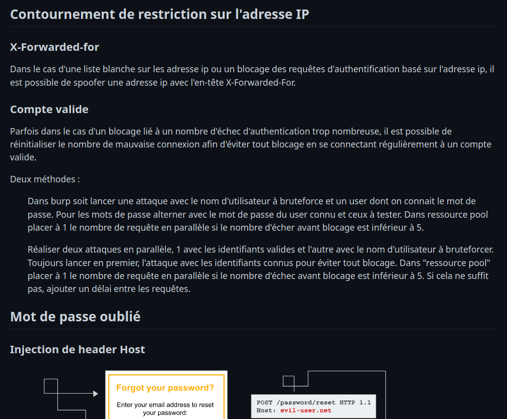

# redview
View markdown file tree in a fancy web interface with two display modes : github like view and markmap mindmap to have an overview of your files.

1 file / 2 views :  
1. Viewed in synthetic form, used as a list of tests to be carried out for pentesting.  
  
2. Markdown view, to have complete information.  
  
Sometimes you have so much data that you're lost because you don't know what's in each file and where to find the information you're looking for. Redview can be the solution :  
  

## Features
- Create summary at the top of each md file.
- Create md summary file in each directory to link md files together.
- Node JS web server to preview md like in github or you can also add your own style.
- Search feature with search filter on the web server to find specific content in md note.
- Node JS web server to preview md as a mindmap with markmap.
- No internet connexion required
- Format web md preview, markmap, md for obsidian (optimized for graph visualization)

+ Configuraiton via yaml and .env file 😊

## When use Redview
1. Preview knowledge notes
  - Stay compatible with all markdown based tools used to take note (gitbook, github...)
  - Take your note from everywhere, on the web, in vs code, in a notepad or in vi.
  - Preview your notes offline
  - See your notes as mind map without modification to have a global view. In case of pentest notes, it can be used as a "to be done" view to quickly know what tests have to be done on a specific target.
  - Search quickly data in your notes
2. Work on large pentest/audit results
  - Preview a large amount of data with mindmap
  - Search for specific keyword
3. View massive md file tree
  - same argument as for note preview knowledge preview.

You may found other use case of this project.
    
## How it works
When you run the python script a copy of the project is created in the directory provide in argument (/tmp/redview by default). In this new directory, summary are added at the top of each files and directory summary are created for each directory. In addition html file are created for markmap preview.


## How to use it
I provide an example of md structure to help you to test the tool and to provide concrete examples.

### How to start
#### Requirement
Install nodejs and python.
I have to define depandency to install :/

#### Start
Redview work on every markdown directory tree. 
In the redview directory :
```bash
python redview.py -s <your_md_dir_path>
```


Then start the nodejs server with :
```bash
cd /tmp/redview; node server.js
```


you can update node package with :
```bash
npm init -y; npm install express showdown fs path dotenv; node server.js
```

### Organize your data
To have the full power of this tool, you should organized your data. To do this, redview use 2 things : 
- Organize your files in directory tree, redview will generate a 'directory summary' for each directory.
- In addition you can use tag to sort your titles. This makes it possible to group the various titles present in the directory according to categories defined in config.yaml. In the case of my notes, the categories are used to sort my notes according to when they are to be used in the pentest process (enumeration, exploitation, lateral movement...). To use the tag add it in the following format below a markdown title 1 : __#tag:key1,key2__. If it's missing, the title will be categorized like the previous one. If the title has no tag and no previous title, it will be categorized with the -1 key, "other" in the case of our configuration.  

Example :    
A random file :  
```markdown
# Super random title
#Phase:1  
Super random text.

# Another title
#Phase:2,3
Another text.

# A subtitle
  coucou

# Last title
[...]
```

Config.yaml :
```yaml
tag:
    #Note tags
    #This tag can be renamed
    main:
      - Phase:
          "-1" : Others
          "0" : Resources
          "1" : Enumeration
          "2" : Exploitation
          "3" : Privesc
          "4" : Lateral movement
```

The result in the directory summary will be :
```markdown 
# Enumeration
  1. Super random title
# Exploitation
  1. Another title
      - A subtitle
  2. Last title
# Privesc
  1. Another title
     - A subtitle
  2. Last title
```

Note : The use of tag is not required. If it is not used all titles will be categorized as "other".

### How to use web interface
#### Search
Search feature is for the moment only accessible from the markdown preview interface. It is used to search occurence of string into your directory tree.
There are 3 options for the moment :  
<br/>
```txt
>title searchString
```
Search searchString only in titles.   
<br/>
```text
>here searchString
```
Search in the directory tree from your position in the markdown preview.  
<br/>
```text
>unique searchString
```
If found an occurence of searchString in a file return the result and search into the next file.  

### How to pimp the web interface
In the /export/web/.env file you can change the css for the web page (may you want to switch to light mode), or add restricted files and directory.

## How it will works (in the future)
In addition of the current usage, redview will be able to automatically update modification from the original working directory.   
Search based on tags set in yaml at the the top of md files.  
Update your sql db from your md note and vice versa.

__document under construction...__

# redview
View markdown file tree in a fancy web interface with two display modes : github like view and markmap mindmap to have an overview of your files.

1 file / 2 views :  
1. Viewed in synthetic form, used as a list of tests to be carried out for pentesting.  
  
2. Markdown view, to have complete information.  
  
Sometimes you have so much data that you're lost because you don't know what's in each file and where to find the information you're looking for. Redview can be the solution :  
  

## Features
- Create summary at the top of each md file.
- Create md summary file in each directory to link md files together.
- Node JS web server to preview md like in github or you can also add your own style.
- Search feature with search filter on the web server to find specific content in md note.
- Node JS web server to preview md as a mindmap with markmap.
- No internet connexion required
- Format web md preview, markmap, md for obsidian (optimized for graph visualization)

+ Configuraiton via yaml and .env file 😊

## When use Redview
1. Preview knowledge notes
  - Stay compatible with all markdown based tools used to take note (gitbook, github...)
  - Take your note from everywhere, on the web, in vs code, in a notepad or in vi.
  - Preview your notes offline
  - See your notes as mind map without modification to have a global view. In case of pentest notes, it can be used as a "to be done" view to quickly know what tests have to be done on a specific target.
  - Search quickly data in your notes
2. Work on large pentest/audit results
  - Preview a large amount of data with mindmap
  - Search for specific keyword
3. View massive md file tree
  - same argument as for note preview knowledge preview.

You may found other use case of this project.
    
## How it works
When you run the python script a copy of the project is created in the directory provide in argument (/tmp/redview by default). In this new directory, summary are added at the top of each files and directory summary are created for each directory. In addition html file are created for markmap preview.


## How to use it
I provide an example of md structure to help you to test the tool and to provide concrete examples.

### How to start
#### Requirement
Install nodejs and python.
I have to define depandency to install :/

#### Start
Redview work on every markdown directory tree. 
In the redview directory :
```bash
python redview.py -s <your_md_dir_path>
```


Then start the nodejs server with :
```bash
cd /tmp/redview; node server.js
```


you can update node package with :
```bash
npm init -y; npm install express showdown fs path dotenv; node server.js
```

### Organize your data
To have the full power of this tool, you should organized your data. To do this, redview use 2 things : 
- Organize your files in directory tree, redview will generate a 'directory summary' for each directory.
- In addition you can use tag to sort your titles. This makes it possible to group the various titles present in the directory according to categories defined in config.yaml. In the case of my notes, the categories are used to sort my notes according to when they are to be used in the pentest process (enumeration, exploitation, lateral movement...). To use the tag add it in the following format below a markdown title 1 : __#tag:key1,key2__. If it's missing, the title will be categorized like the previous one. If the title has no tag and no previous title, it will be categorized with the -1 key, "other" in the case of our configuration.  

Example :    
A random file :  
```markdown
# Super random title
#Phase:1  
Super random text.

# Another title
#Phase:2,3
Another text.

# A subtitle
  coucou

# Last title
[...]
```

Config.yaml :
```yaml
tag:
    #Note tags
    #This tag can be renamed
    main:
      - Phase:
          "-1" : Others
          "0" : Resources
          "1" : Enumeration
          "2" : Exploitation
          "3" : Privesc
          "4" : Lateral movement
```

The result in the directory summary will be :
```markdown 
# Enumeration
  1. Super random title
# Exploitation
  1. Another title
      - A subtitle
  2. Last title
# Privesc
  1. Another title
     - A subtitle
  2. Last title
```

Note : The use of tag is not required. If it is not used all titles will be categorized as "other".

### How to use web interface
#### Search
Search feature is for the moment only accessible from the markdown preview interface. It is used to search occurence of string into your directory tree.
There are 3 options for the moment :  
<br/>
```txt
>title searchString
```
Search searchString only in titles.   
<br/>
```text
>here searchString
```
Search in the directory tree from your position in the markdown preview.  
<br/>
```text
>unique searchString
```
If found an occurence of searchString in a file return the result and search into the next file.  

### How to pimp the web interface
In the /export/web/.env file you can change the css for the web page (may you want to switch to light mode), or add restricted files and directory.

## How it will works (in the future)
In addition of the current usage, redview will be able to automatically update modification from the original working directory.   
Search based on tags set in yaml at the the top of md files.  
Update your sql db from your md note and vice versa.

__document under construction...__

